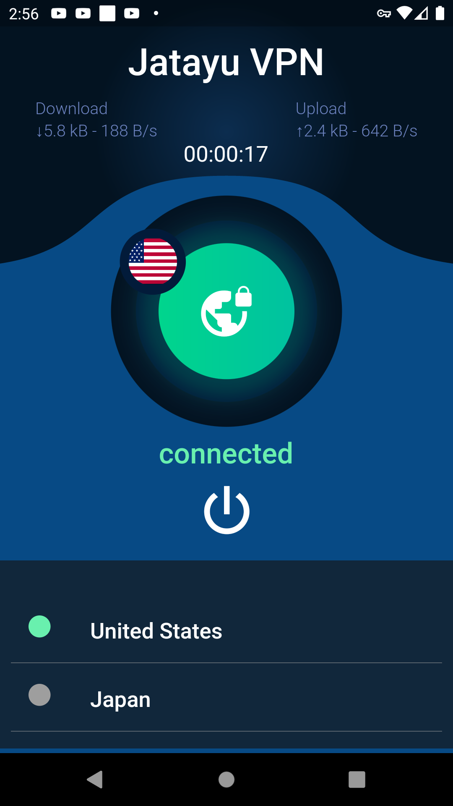
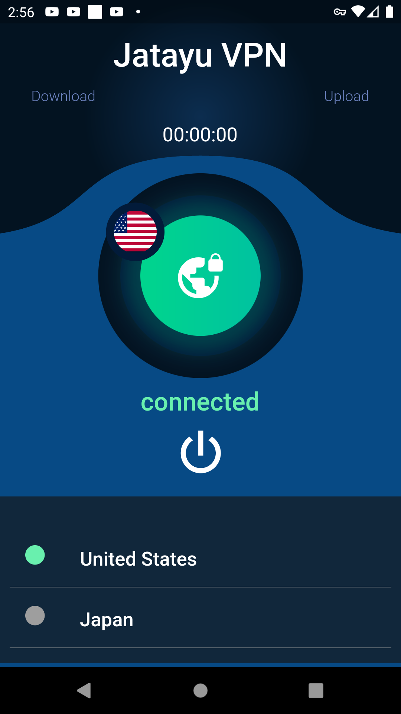
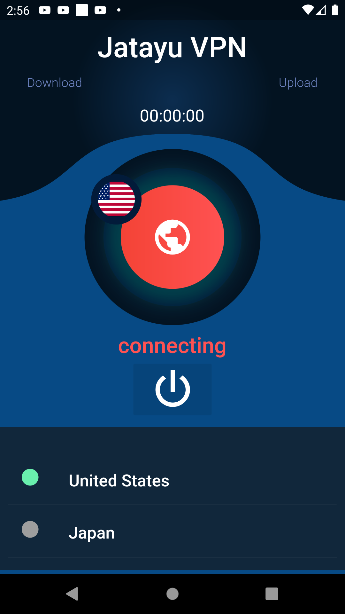
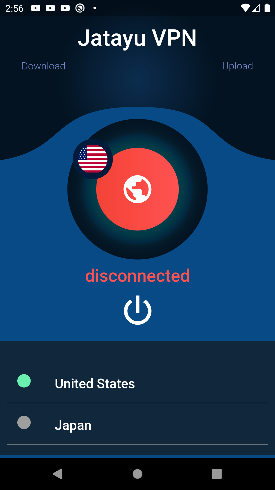

# Jatayu VPN

**Jatayu VPN** is a free VPN application designed to provide secure, private, and unrestricted internet access. Whether you're trying to escape data throttling, avoid bandwidth limitations, or simply browse privately, Jatayu VPN has you covered.

## 🖥️ Screenshots

---

## 🚀 **Key Features**

- **🌍 Access Multiple Regions:** Seamlessly connect to servers from various regions worldwide.
- **🛡️ Privacy Protection:** Mask your IP address, location, and search history to stay invisible from ISPs, websites, and third parties.
- **🔒 Enhanced Security:** Encrypt your personal information during transit to protect sensitive data.
- **⚡ Escape Data-Throttling:** Maintain fast internet speeds without interference from your ISP.
- **📊 Avoid Bandwidth Throttling:** Enjoy unrestricted bandwidth usage for streaming, gaming, or browsing.

---

## 📥 **Installation**

1. **Download the App:** Get Jatayu VPN from the official website or app store.
2. **Install:** Follow the installation instructions for your device.
3. **Launch:** Open the app and create an account or log in.
4. **Connect:** Choose your preferred region and tap **"Connect"**.

---

## 📚 **How to Use**

1. Open **Jatayu VPN**.
2. Select a **server location**.
3. Click on the **Connect** button.
4. Once connected, enjoy secure and private browsing!

---

## 🛡️ **Privacy and Security**

- **Zero Logs Policy:** We do not store any of your activity logs.
- **AES-256 Encryption:** Military-grade encryption to ensure your data is secure.
- **Secure Protocols:** Support for OpenVPN, IKEv2, and WireGuard protocols.

---

## 💻 **Supported Platforms**

- Android
- iOS
- Windows
- macOS
- Linux

---

## 🤝 **Contributing**

We welcome contributions from the community! Please check our [Contribution Guidelines](CONTRIBUTING.md).

---

## 📞 **Support**

- **Website:** [www.jatayuvpn.com](https://www.jatayuvpn.com)
- **Support Email:** support@jatayuvpn.com
- **Community Forum:** [Join our community](https://forum.jatayuvpn.com)

---

## 📜 **License**

This project is licensed under the **MIT License**.

---

*Stay private. Stay secure. Browse freely with Jatayu VPN.* 🌐🛡️

